# Framework for Applications Web Scalables and Advanced Customizability – FAWSAC
###### Full-Stack Framework Java

# 1.   Instalación y configuración

## 1.1.  Instalar localmente el framework

Para realizar la instalación localmente del framework se recomienda utilizar el editor de código Intellij IDEA, debido a que es necesario utilizar 2 complementos, el primero es Lombok y el segundo es ZK, estos se muestran en las siguientes imágenes:

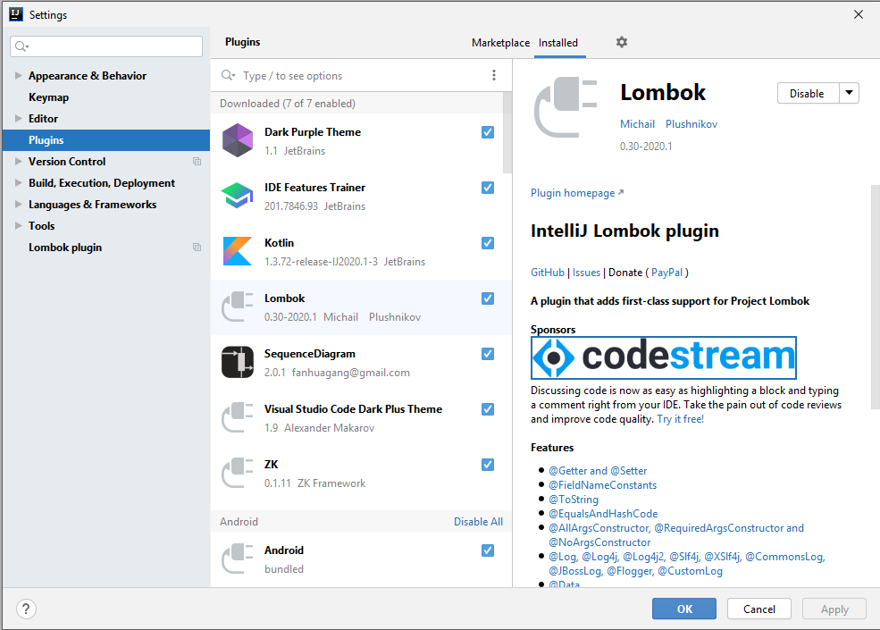

Ilustración 1. Complemento Lombok

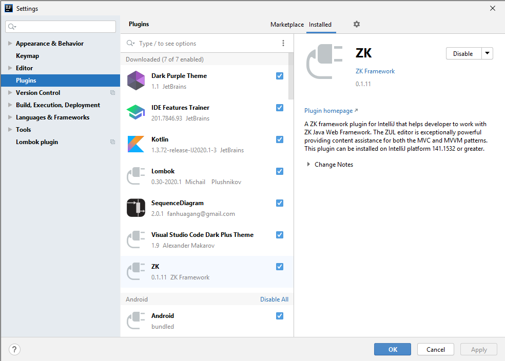

Ilustración 2. Complemento ZK

Luego para realizar la compilación e instalación del proyecto lo primero que se tiene que hacer es importar dentro de Intellij IDEA con la siguiente opción

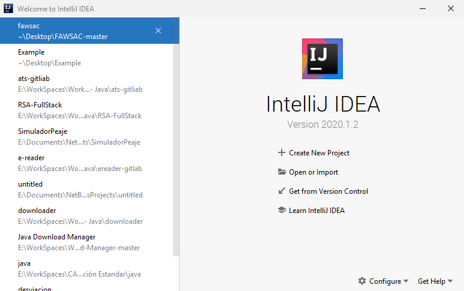

Ilustración 3. Opción de importación de proyecto.

Una vez importado el proyecto lo único que se tiene que realizar es la ejecución de la tarea “install” de Maven para que se realice todo el proceso de compilación e instalación locamente, para ello hay que utilizar la opción del panel lateral “maven” y posteriormente ejecutar con doble clic la tarea “install” del proyecto Maven de nombre “fawsac (root)”, el cual corresponde al padre de todos los módulos del proyecto

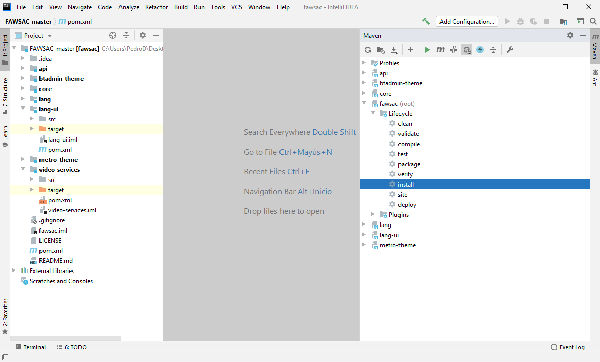

Ilustración 4. Ejecución de la tarea de instalación.

Una vez termine la ejecución de la tarea estaría instalado localmente el framework dentro del repositorio local de Maven, lo que permitiría la utilización del framework a nivel local en cualquier proyecto Maven.

## 1.2.  Iniciar un proyecto con el framework

Para iniciar un proyecto en el cual se utilice el framework lo primero que hay que realizar es crear el proyecto, este proyecto puede ser creado con la aplicación:

[https://start.spring.io](https://start.spring.io/)

Dentro de esta aplicación puede seleccionar las dependencias necesarias para el framework, como lo es la dependencia **Spring Web**, la otra dependencia que sería necesaria seria el controlador para la base de datos que se va a utilizar, esta dependencia se puede seleccionar también en la parte de dependencias, al finalizar la selección y el llenado de los datos el formulario de creación debería verse similar a este ejemplo:

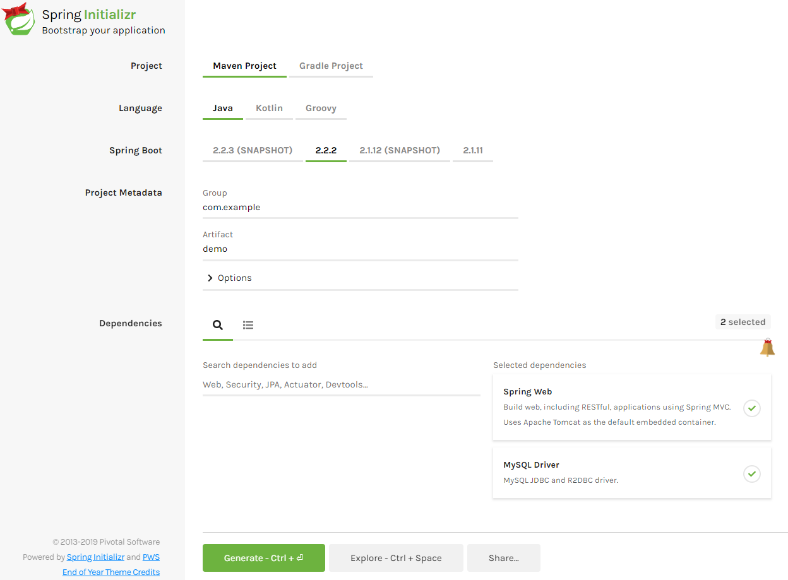

Ilustración 5. Ejemplo de proyecto base en https://start.spring.io/

En este ejemplo aparte de **Spring Web** se seleccionó el controlador para la base de datos MySQL.

Después de la creación del proyecto lo que faltaría hacer es agregar las dependencias del framework en el apartado de dependencias del archivo pom.xml del proyecto generado, las dependencias a agregar son:

​        

​        <**dependency**>       <**groupId**>com.gitlab.pedrioko</**groupId**>       <**artifactId**>core</**artifactId**>       <**version**>1.0.0.BETA</**version**>     </**dependency**>     <**dependency**>       <**groupId**>com.gitlab.pedrioko</**groupId**>       <**artifactId**>metro-theme</**artifactId**>       <**version**>1.0.0.BETA</**version**>     </**dependency**>    ` `    

Ilustración 6. Dependencias del framework

Una vez agregadas estas 2 dependencias el proyecto ya puede hacer uso del framework y se puede ejecutar el proyecto.

 

 

 

 

 

 

 

 

 

 

 

# 2.   Aspectos Generales

## 2.1.  Entidades y Componentes

Dentro del framework se encuentran disponible entidades y componentes que facilitan la creación de funcionalidades y requerimientos, a continuación, está el listado de todas las entidades y componentes:

### 2.1.1.   BaseEntity

Esta entidad es la que utiliza el framework para las diferentes entidades que tiene y que son guardadas en la base de datos a la cual se conectara el software, adicionalmente esta clase es la que se debe utilizar en las demás entidades del software para que se pueda llevar un registro auditable de los diferentes cambios que tengas los datos como los son la fecha de creación, la fecha de última modificación del registro y además de tener la propiedad version, la cual es utilizada por hibernate para evitar concurrencias en la actualización de datos.

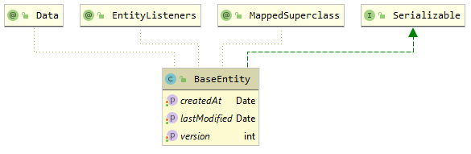

Ilustración 7. Diagrama de propiedades de la entidad BaseEntity

 

### 2.1.2.   Polygon y PolygonGmap

Polygon es la entidad que se debe usar en el caso que se necesite crea un polígono de mapa de google, esta clase aparte le indica al generador de vistas del framework que debe usar PolygonGmap como componente visual para el ingreso de datos.

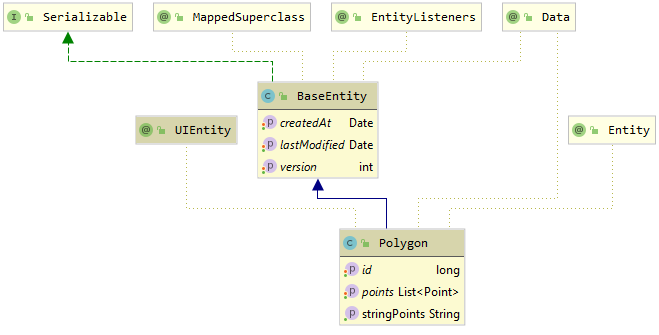

Ilustración 8. Diagrama de propiedades de la entidad Polygon.

PolygonGmap es una clase que hereda de la clase Gmap de ZKoss que es la representación en java del mapa de google JS, esta clase hereda todo lo de Gmap con la característica principal que está configurada para la creación de polígonos, cuando es llamado el método getValue() este retorna el polígono creado en el mapa siendo una instancia de la clase Polygon.

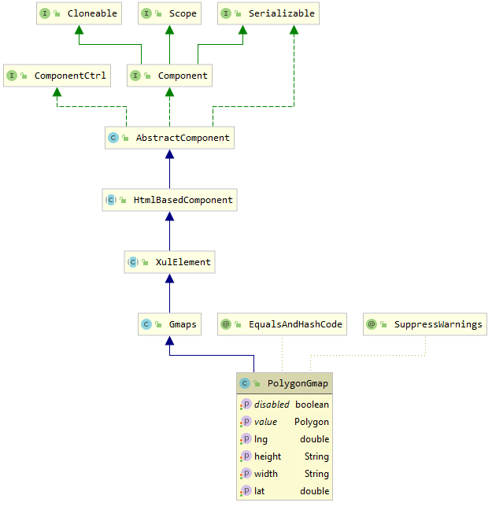

Ilustración 9. Diagrama de propiedades del componente PolygonGmap.

### 2.1.3.   Point y PointGmap

Point es la entidad que se debe usar en el caso que se necesite un punto de mapa de google, esta clase le indica al generador de vistas del framework que debe usar PointGmap como componente visual de ingreso de datos.

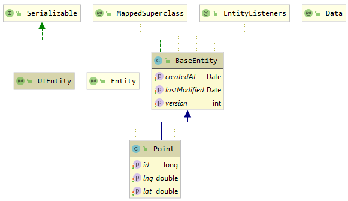

Ilustración 10. Diagrama de propiedades de la entidad Point.

PointGmap es una clase que hereda de la clase Gmap de ZKoss que es la representación en java del mapa de google JS, esta clase hereda todo lo de Gmap con la característica principal que es esta configurado para la creación de un punto, cuando es llamado el método getValue() este retorna el punto creado en el mapa siendo una instancia de la clase Point.

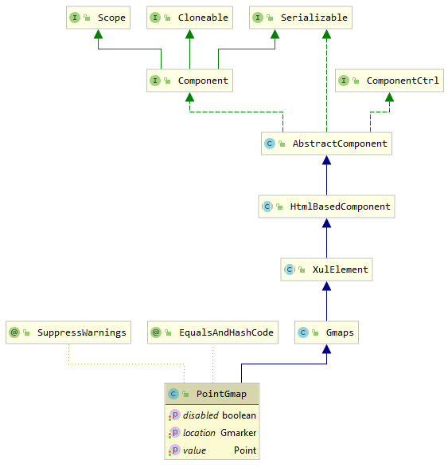

Ilustración 11. Diagrama de propiedades del componente PointGmap

### 2.1.4.   FileEntity y FileUpload

FileEntity es la entidad que se debe usar en el caso que se necesite tener un archivo adjunto en una clase, esta clase es la representación y enlace a los archivos gestionados por el framework, le indica al generador de vistas del framework que debe usar FileUpload como componente de ingreso de datos, además el núcleo ya se encarga de guardar el archivo en la ubicación de datos del servidor.

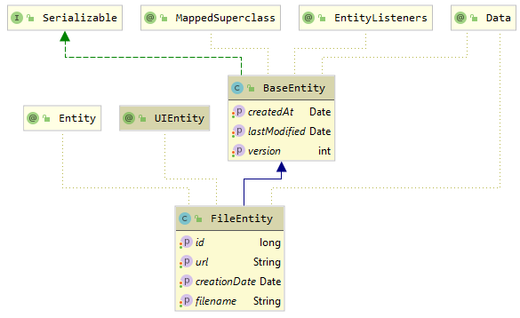

Ilustración 12. Diagrama de propiedades de la entidad FileEntity.

FileUpload es una clase que hereda de la clase Fileupload de ZKoss que es la representación de un botón con la función de subir archivo, sin embargo, la diferencia radica que esta clase en getValue() devuelve una instancia de la clase FileEntity que a diferencia del File que devuelve el getValue() de la clase Fileupload.

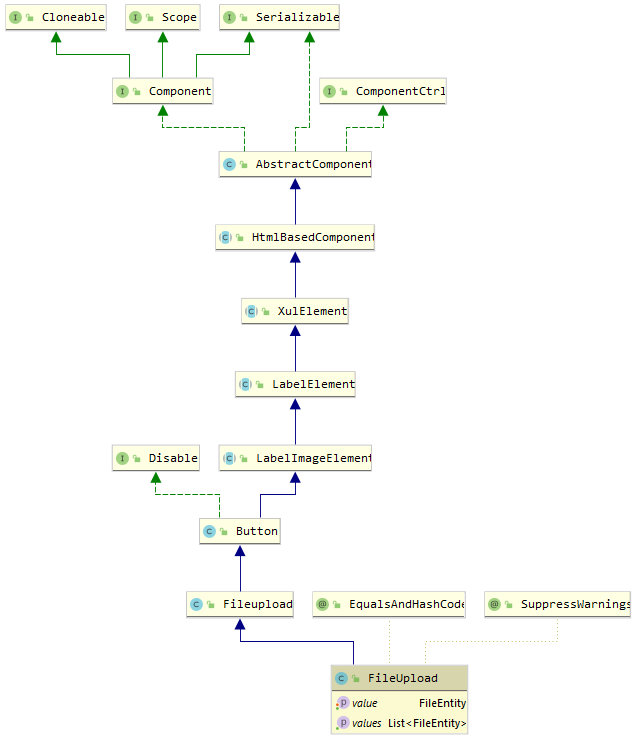

Ilustración 13. Diagrama de propiedades del componente FileUpload.

### 2.1.5.   Usuario

Esta entidad es la que utiliza el framework para el inicio de sesión dentro del software en tiempo de ejecución, esta entidad cuenta con una variedad de propiedades las cuales pueden ser utilizadas a necesidad por el framework o por requerimientos del software a desarrollar.

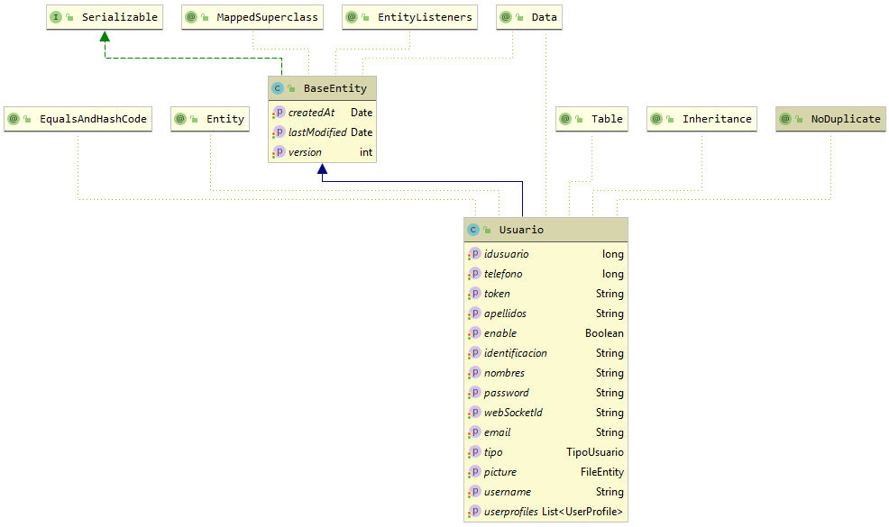

Ilustración 14. Diagrama de propiedades de la entidad Usuario.

### 2.1.6.   EmailAccount

Esta entidad es la que utiliza el framework para la cuenta de correo que es configurada en el software en tiempo de ejecución, esta entidad cuenta con todos los datos necesarios para conectarse al servidor de correos y enviar correos desde el software.

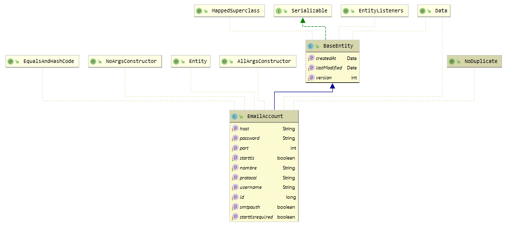

Ilustración 15. Diagrama de propiedades de la entidad EmailAccount.

## 2.2.  Anotaciones del framework

 

El framework cuenta con anotaciones propias que indican validaciones que se tendrían que realizar, así como que se debe usar un componente visual específico, entre otros procedimientos.

**2.2.1.**   **NoEmpty**

Esta anotación es para usarse propiedades de tipo String, esta anotación sólo afecta a los formularios generados y este indica al framework que las propiedades del formulario anotadas con esta anotación no pueden quedar en null o un String vacío, además el framework mostrara una notificación al usuario. 

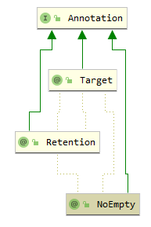

Ilustración 16. Diagrama de la anotación NoEmpty.

### 2.2.2.   Password

Esta anotación es para usarse propiedades de tipo String, esta anotación se utiliza para indicar que el valor de la propiedad anotada será una contraseña, por lo que el framework al detectar esta anotación realizara un proceso de encriptado del valor utilizan el algoritmo Bcrypt, este algoritmo lo aplica al momento en que se está creando o actualizando un objeto en la base de datos.

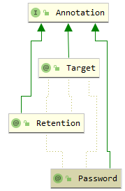

Ilustración 17. Diagrama de la anotación Password.

### 2.2.3.   Email

Esta anotación es para usarse propiedades de tipo String, y esta anotación le indica al núcleo que dicha propiedad debe ser un email por lo cual este realiza las validaciones necesarias para verificar que el valor de la propiedad sea un email.

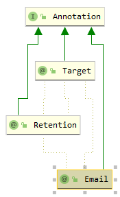

Ilustración 18. Diagrama de la anotación Email.

### 2.2.4.   Ckeditor

Esta anotación es para usarse propiedades de tipo String, esto le indica al framework que para esta propiedad no debe usar un TextField si no el componente CKeditor que es un WYSWYG.

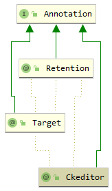

Ilustración 19. Diagrama de la anotación Ckeditor.

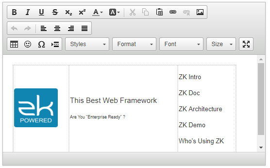

Ilustración 20. Imagen de muestra de Ckeditor en el navegador.

### 2.2.5.   NoDuplicate

Esta anotación es para nivel de clase, esta anotación se usa cuando se requiere tener registros únicos en base a una propiedad, para especificar la propiedad de la clase por la cual se realizará la validación se tiene que utilizar la propiedad value de la anotación, por ejemplo:

​     

​    `**import** com.gitlab.pedrioko.core.lang.annotation.NoDuplicate;    **import** com.gitlab.pedrioko.core.lang.annotation.NoEmpty;    **import** lombok.Data;        **import** javax.persistence.*;        @Entity @NoDuplicate(values = {**"nombre"**})    **public** @Data    **class** Reporte **extends** BaseEntity {   @Id   @GeneratedValue(strategy = GenerationType.***AUTO\***)   **private long** **id**;``   @Lob   @NoEmpty   **private** String **nombre**;     }`    

Ilustración 21. Ejemplo del uso de la anotación NoDuplicate.

En este ejemplo de NoDuplicate se le está indicando al framework que no debe haber 2 registros de la clase Reporte en la base de datos que tengan el mismo nombre.

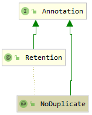

Ilustración 22. Diagrama de la anotación NoDuplicate.

### 2.2.6.   Menú

Esta anotación es para nivel de clase, ella hace que la clase se considera un Bean por Spring y este a si vez crea un singleton de la clase, esta anotación se utiliza para los botones menú del menú generado por el framework.

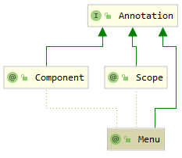

Ilustración 23. Diagrama de la anotación Menú.

 

 

 

 

 

 

 

 

 

 

 

 

 

## 2.3.  Auditoría de datos

El framework maneja una auditoria para las consultas realizadas a la base de datos mediante el uso del acceso a datos del framework CrudService, la auditoría es llevada a cabo por interceptor de Hibernate, lo que asegura que todas las consultas realizadas serán auditadas y se creará un registro en la base de datos de la entidad AuditLog.

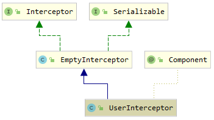

Ilustración 24. Diagrama del interceptor UserInterceptor.

El registro de AuditLog como lo muestra el diagrama tiene una diversidad de datos que permitirán llevar un seguimiento sobre qué usuario realizó una acción (Crear, Actualizar, Eliminar), también desde que dirección IP se realizó la consulta, fecha en la que, sucedido, el id de ese usuario, el nombre del usuario, entre otros datos.

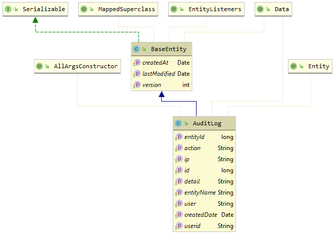

Ilustración 25.Diagrama de propiedades de la entidad AuditLog.

La vista CRUD generada en base a la clase AuditLog no tiene habilitadas las acciones crear, editar, ver y eliminar, por seguridad y para evitar modificaciones en los datos, además no hay forma de habilitar de nuevo estas acciones. 

 

 

 

 

 

 

 

 

 

# 3.   Funcionalidades principales del framework

## 3.1.  Servicios del framework

Dentro del framework hay servicios que se utilizan para realizar procesos internos, estos servicios también pueden ser utilizadas para realizar funciones o requerimientos específicos, los servicios son los siguientes:

### 3.1.1.   CrudService

Este servicio es utilizado para realizar las operaciones CRUD (crear, leer, actualizar y eliminar) sobre la base de datos, este servicio es un objeto singleton dentro de spring por lo que puede ser incluido dentro de otros componentes que utilicen spring mediante la anotación Autowired, por ejemplo:

​     
<code>
​    ​import com.gitlab.pedrioko.services.CrudService;    
​    import org.springframework.beans.factory.annotation.Autowired;
​    import org.springframework.stereotype.Component;    
​                                        
    @Component    
    public class ExampleComponent {  
        
        @Autowired   
        private CrudService crudService;
    
    }
</code>

Ilustración 26. Ejemplo de componente con autowired para CrudService

En la ilustración 22 se muestra un ejemplo de un componente de Spring que tiene como una propiedad el CrudService, el cual será instanciado mediante el control de singleton’s de Spring debido a que tiene la anotación autowired.

#### *3.1.1.1.*      *Métodos*

Este servicio cuenta con una variedad de métodos para realizar diferentes funciones, estos son:

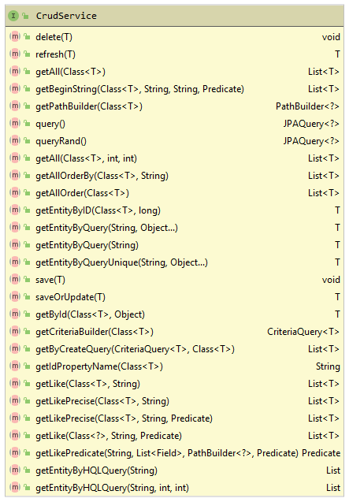

Ilustración 27. Diagrama de métodos de la interfaz del servicio CrudService.

·     <T> void delete(T klass): este método sirve para eliminar de la base de datos el objeto recibido en el parámetro klass.

·     <T> T refresh(T klass): este método sirve para actualizar los datos del objeto recibido en el parámetro klass.

·     <T> List<T> getAll(Class<T> klass): este método retorna todos los objetos que están en la base de datos de la clase recibida en parámetros.

·     <T> List<T> getBeginString(Class<T> klass, String text, String field, Predicate aditional): este método realiza una consulta de los registros de la clase recibida en parámetros y que en los atributos de texto inician con el valor recibido en el parámetro text.

·     <T> PathBuilder<?> getPathBuilder(Class<T> klass): este método retorna el PathBuilder de la clase recibida en parámetro.

·     JPAQuery<?> query(): este método retorna el JPAQuery para hacer consultas utilizando QueryDSL.

·     JPAQuery<?> queryRand():este método retorna el JPAQuery para hacer consultas utilizando QueryDSL e incluye la función random para bases de datos relacionales.

·     <T> List<T> getAll(Class<T> klass, int firstResult, int maxResults): este método retorna todos los objetos que están en la base de datos de la clase recibida en parámetros y permite establecer el punto de inicio de los registros a obtener y así mismo la cantidad de registros que se tendrán en el resultado.

·     <T> List<T> getAllOrderBy(Class<T> klass, String orderby): este método retorna todos los objetos que están en la base de datos de la clase recibida en parámetros klass y ordenados por el nombre atributo recibido en el parámetro orderby.

·     <T> List<T> getAllOrder(Class<T> klass): este método retorna todos los objetos que están en la base de datos de la clase recibida en parámetros klass y ordenados por el nombre atributo que fue colocado en la anotación CrudOrderBy.

·     <T> T getEntityByID(Class<T> klass, long id): este método retorna el registro de la clase recibida en el parámetro klass y que tiene como valor de id el recibido en el parámetro id.

·     <T> T getEntityByQuery(String query, Object... params): este método sirve para realizar consultas SQL utilizando el lenguaje HQL de hiberntate, además permite utilizar parámetros dentro de la sentencia los cuales pueden recibidos mediante el parámetro params.

·     <T> T getEntityByQuery(String query): este método sirve para realizar consultas SQL utilizando el lenguaje HQL de hiberntate.

·     <T> T getEntityByQueryUnique(String query, Object... params): este método sirve para realizar consultas SQL utilizando el lenguaje HQL de hiberntate que retornara un único registro.

·     <T> void save(T klass):este método permite guardar en la base de datos el objeto recibido en el parámetro.

·     <T> T saveOrUpdate(T klass): este método permite guardar o actualizar un registro existe en la base de datos utilizando objeto recibido en el parámetro.

·     <T> T getById(Class<T> klass, Object key): este método retorna el registro de la clase recibida en el parámetro klass y que tiene como valor de id el recibido en el parámetro key.

·     <T> CriteriaQuery<T> getCriteriaBuilder(Class<T> klass): este método retorna el CriteriaQuery correspondiente a la clase recibida en el parámetro klass.

·     <T> List<T> getByCreateQuery(CriteriaQuery<T> criteria, Class<T> klass): este método permite utilizar el CriteriaQuery recibido en el parámetro criteria para obtener todos los registros de la clase klass.

·     <T> String getIdPropertyName(Class<T> klass): este método retorna el nombre del atributo que actúa como llave primaria para la clase recibida en el parámetro klass.

·     <T> List<T> getLike(Class<T> klass, String text): este método permite realizar una consulta donde se revisan todos los registros de la clase recibida en el parámetro klass y que en los atributos de tipo String contienen el valor recibido en el parámetro text.

·     <T> List<T> getLikePrecise(Class<T> klass, String text): este método permite realizar una consulta donde se revisan todos los registros de la clase recibida en el parámetro klass y que en los atributos de tipo String es igual a el valor recibido en el parámetro text.

·     <T> List<T> getLikePrecise(Class<T> klass, String text, Predicate where): este método permite realizar una consulta donde se revisan todos los registros de la clase recibida en el parámetro klass y que en los atributos de tipo String es igual a el valor recibido en el parámetro text con la posibilidad de agregar otras condiciones a la consulta mediante el uso de un Predicate el cual es recibido en el parámetro where.

·     <T> List<T> getLike(Class<?> klass, String value, Predicate where): este método permite realizar una consulta donde se revisan todos los registros de la clase recibida en el parámetro klass y que en los atributos de tipo String contienen el valor recibido en el parámetro text con la posibilidad de agregar otras condiciones a la consulta mediante el uso de un Predicate el cual es recibido en el parámetro where.

·     Predicate getLikePredicate(String text, List<Field> fields, PathBuilder<?> pathBuilder, Predicate aditional): este método permite construir una condición de consulta para realizar una búsqueda sobre los campos recibidos en el parámetro fields y que su valor sea igual al valor recibido en el parámetro text.

·     <T> List getEntityByHQLQuery(String s): este método permite realizar una consulta sql utilizando el lenguaje HQL.

·     <T> List getEntityByHQLQuery(String s, int offset, int limit): este método permite realizar una consulta sql utilizando el lenguaje HQL además de poder especificar el inicio de la consulta y la cantidad de registros a obtener en la consulta.

### 3.1.2.   MailService

Este servicio es utilizado por framework para enviar correos mediante la cuenta de correo configura en el software en tiempo de ejecución además este servicio es un objeto singleton dentro de spring por lo que puede ser incluido dentro de otros componentes que utilicen spring mediante la anotación Autowired, por ejemplo:

​     

​        **import** com.gitlab.pedrioko.services.CrudService;     **import** com.gitlab.pedrioko.services.MailService;     **import** org.springframework.beans.factory.annotation.Autowired;     **import** org.springframework.stereotype.Component;          @Component     **public class** ExampleComponent {            @Autowired       **private**    MailService **paramService**;          }        

Ilustración 28. Ejemplo de componente con autowired para MailService.

#### 3.1.2.1.            Métodos

Este servicio cuenta con una variedad de métodos para realizar diferentes funciones, estos son:

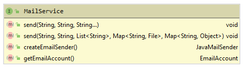

Ilustración 29. Diagrama de métodos de la interfaz del servicio MailService.

·     send (Spring, Spring, Spring...): este método sirve para enviar correos utilizando los valores recibidos que son el asunto, el contenido del correo y finalmente los correos de destino.

·     send(String, String, List<String>, Map<String, File>, Map<String, Object>): este método sirve para enviar correos utilizando los valores recibidos que son el asunto, el contenido del correo, los correos de destino, archivos adjuntos y listado de valores que se colocarían en el cuerpo del correo.

·     createEmailSender (): este método devuelve el objeto JavaMailSender que se utiliza para enviar el correo.

·     getEmailAccount (): este método devuelve la EmailAccount que tiene los datos de la cuenta de correo configurada para el software.

### 3.1.3.  ParamService

Este servicio es utilizado por framework para obtener y colocar parámetros globales en el software que son utilizados para diferentes procesos y validaciones, este servicio se puede utilizar para crear parámetros de acuerdo a los requerimientos del software, además este servicio es un objeto singleton dentro de spring por lo que puede ser incluido dentro de otros componentes que utilicen spring mediante la anotación Autowired, por ejemplo:

​     

​        **import** com.gitlab.pedrioko.services.CrudService;     **import** com.gitlab.pedrioko.services.ParamService;     **import** org.springframework.beans.factory.annotation.Autowired;     **import** org.springframework.stereotype.Component;          @Component     **public class** ExampleComponent {            @Autowired       **private**    ParamService **paramService**;          }        

Ilustración 30. Ejemplo de componente con autowired para ParamService.

#### 3.1.3.1.            Métodos

Este servicio cuenta con una variedad de métodos para realizar diferentes funciones, estos son:

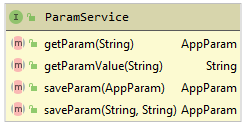

Ilustración 31. Diagrama de métodos de la interfaz del servicio ParamService.

·     getParam(): este método devuelve el AppParam que tiene la misma llave que es recibida en el parámetro.

·     getParamValue(): este método devuelve el valor del AppParam que tiene la misma llave que es recibida en el parámetro.

·     saveParam(AppParam): este método sirve para guardar y actualizar un AppParam.

·     saveParam(String, String): este método sirve para crear y guardar un nuevo parámetro global en la base de datos.

### 3.1.4.  SecurityService

Este servicio es utilizado por framework para validar el acceso y permisos del usuario a los diferentes menús del software en tiempo de ejecución, este servicio es un objeto singleton dentro de spring por lo que puede ser incluido dentro de otros componentes que utilicen spring mediante la anotación Autowired, por ejemplo:

​     

​        **import** com.gitlab.pedrioko.services.CrudService;     **import** com.gitlab.pedrioko.services.SecurityService;     **import** org.springframework.beans.factory.annotation.Autowired;     **import** org.springframework.stereotype.Component;          @Component     **public class** ExampleComponent {            @Autowired       **private**    SecurityService **securityService**;          }        

Ilustración 32. Ejemplo de componente con autowired para SecurityService.

#### 3.1.4.1.            Métodos

Este servicio cuenta con una variedad de métodos para realizar diferentes funciones, estos son:

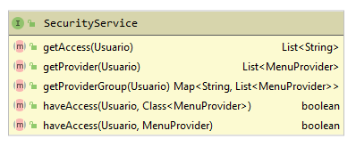

Ilustración 33. Diagrama de métodos de la interfaz del servicio SecurityService.

·     getAccess(): este método devuelve todos los nombres de los MenuProvider a los cuales el usuario tiene acceso.

·     getProvider(): este método devuelve todos los MenuProvider a los cuales el usuario tiene acceso. 

·     getProviderGroup(): este método devuelve todos los MenuProvider a los cuales el usuario tiene acceso y agrupados por el grupo al cual pertenecen.

·         haveAccess(Usuario, Class<MenuProvider>): este método valida si el usuario tiene acceso a la clase de menú que recibe.

·         haveAccess(Usuario, MenuProvider): este método valida si el usuario tiene accesos a la instancia de menú que recibe.

### 3.1.5.  StorageService

Este servicio es utilizado por framework para la gestión de archivos gestionados por el usuario o por el mismo framework, este servicio es un objeto singleton dentro de spring por lo que puede ser incluido dentro de otros componentes que utilicen spring mediante la anotación Autowired, por ejemplo:

​     

​    `**import** com.gitlab.pedrioko.services.CrudService;    **import** com.gitlab.pedrioko.services.StorageService;    **import** org.springframework.beans.factory.annotation.Autowired;    **import** org.springframework.stereotype.Component;        @Component    **public class** ExampleComponent {       @Autowired   **private** StorageService **securityService**;     }`    

Ilustración 34. Ejemplo de componente con autowired para StorageService.

#### 3.1.5.1.            Métodos

Este servicio cuenta con una variedad de métodos para realizar diferentes funciones, estos son:

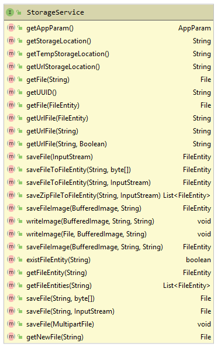

Ilustración 35. Diagrama de métodos de la interfaz del servicio StorageService.

·     getAppParam(): este método devuelve el parámetro global asociado la ubicación donde se guardar los archivos del software en tiempo de ejecución.

·     getStorageLocation(): este método devuelve la ubicación donde se guardar los archivos del software en tiempo de ejecución.

·     getTempStorageLocation(): este método devuelve la ubicación donde se guardar los archivos temporales del software en tiempo de ejecución.

·     getUrlStorageLocation(): este método devuelve la url base asociada a los archivos del software en tiempo de ejecución.

·     getFile(String filename): este método devuelve el File con el nombre recibido en el parámetro.

·     getUUID(): este método devuelve un valor UUID aleatorio en formato de texto.

·     getFile(FileEntity filename): este método devuelve el File asociado al FileEntity recibido en el parámetro.

·     getUrlFile(FileEntity filename): este método devuelve la url del File asociado al FileEntity recibido en el parámetro.

·     getUrlFile(String filename): este método devuelve la url del File asociado al nombre recibido en el parámetro.

·     getUrlFile(String filename, Boolean statics): este método devuelve la url del File asociado al FileEntity recibido en el parámetro.

·     saveFile(InputStream inputstream): este método guarda el InputStream recibido en parámetro como un File y retorna el FileEntity que es asociado a este.

·     saveFileToFileEntity(String filename, byte[] inputstream): este método guarda el byte[] recibido en parámetro como un File con el nombre recibido en parámetro y retorna el FileEntity que es asociado a este.

·     saveFileToFileEntity(String filename, InputStream inputstream): este método guarda el InputStream recibido en parámetro como un File con el nombre recibido en parámetro y retorna el FileEntity que es asociado a este.

·     saveZipFileToFileEntity(String filename, InputStream inputstream): este método guarda el InputStream recibido en parámetro, el cual sería un archivo zip, para guardarlo como varios File que tiene como base el nombre recibido en parámetro y retorna el FileEntity que es asociado a este.

·     saveFileImage(BufferedImage bufferedImage, String fileName): este método guarda el bufferedImage recibido en parámetro como un File con el nombre recibido en parámetro y retorna el FileEntity que es asociado a este.

·     writeImage(BufferedImage bufferedImage, String fileName, String extension): este método guarda el bufferedImage recibido en parámetro como un File con el nombre recibido en parámetro, además de colocarle la extensión recibida en parámetros, este método retorna el FileEntity que es asociado a esta imagen.

·     writeImage(File output, BufferedImage bufferedImage, String extension): este método guarda el bufferedImage recibido en parámetro como un File con el nombre recibido en parámetro, además de colocarle la extensión recibida en parámetros, este método retorna el FileEntity que es asociado a esta imagen.

·     saveFileImage(BufferedImage bufferedImage, String fileName, String extension): este método guarda el bufferedImage recibido en parámetro como un File con el nombre recibido en parámetro, además de colocarle la extensión recibida en parámetros, este método retorna el FileEntity que es asociado a esta imagen.

·     existFileEntity(String fileName): este método valida si existe un FileEntity asociado al nombre archivo que es recibido en el parámetro, retorna true en caso que exista y en caso contrario retorna false.

·     getFileEntity(String fileName): este método retorna el FileEntity asociado al nombre de archivo recibido en el parámetro.

·     getFileEntities(String fileName): este metodo devuelve un listado de FileEntity que contengan el nombre recibido en el parámetro.

·     saveFile(String filename, byte[] data): este método guarda el byte[] recibido en parámetro como un File con el nombre recibido en el parámetro y retorna el File que es creado.

·     saveFile(String name, InputStream inputstream): este método guarda el inputstream recibido en parámetro como un File con el nombre recibido en el parámetro y retorna el File que es creado.

·     saveFile(MultipartFile file): este método guarda el MultipartFile recibido en parámetro como un File.

·     getNewFile(String fileName): este método crea un archivo con el nombre recibido en el parametro 

## 3.2.    Vistas CRUD

La vistas CRUD es uno de los componentes principales del framework y la razón por la que se creó este, este componente para su creación dinámica utiliza las propiedades de la clase base para determinar los valores que sean mostrados en listado de registros (Objetos almacenados en la base de datos), adicionalmente tiene las diferentes acciones que se pueden realizar para la clase base, estas incluyen las acciones por defecto como Crear, Leer, Editar y Eliminar, adicionalmente saldrías las acciones que se hayan creado para aplicados a la clase base.

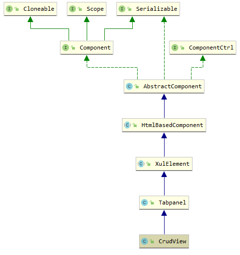

Ilustración 36. Diagrama del componente CrudView

Las vistas crud dentro del framework son creadas mediante la clase CrudView, como lo muestra el diagrama el componente CrudView hereda de la clase Tabpanel del framework ZK, con esta herencia el CrudView tiene todas las propiedades y métodos de este, los cuales son utilizados para realizar cada una de las operaciones y a su vez generar la vista que será renderizada al usuario en el navegador. La herencia de la clase Tabpanel se escogió con la finalidad que los software a desarrollar manejen un sistema pestañas para cada una de sus vistas, esto es con la finalidad de permitir la multitarea al usuario final.

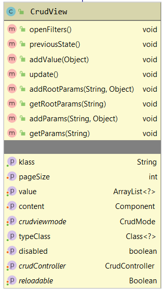

Ilustración 37. Diagrama de propiedades del componente CrudView

En el anterior diagrama se observan cada uno de los métodos y propiedades propias de la clase CrudView, cada uno de estos tienen las siguientes funciones:

### 3.2.1.  Propiedades

·     klass: es el nombre de la clase base en formato de texto.

·     pageSize: es la cantidad de registro que saldrán por cada página del CrudView.

·     value: es el listado de registros que actualmente están el CrudView.

·     content: son los componentes que está actualmente siendo renderizado dentro del CrudView.

·     crudviewmode: especifica el modo de operación del CrudView.

·     typeClass: es la clase base del CrudView.

·     disabled: esta propiedad sirve para inhabilitar todas las acciones de un CrudView.

·     crudController: es el controlador del CrudView el cual es el encargado de los registros que salen actualmente en el crudview, así como también se encarga de ir cambiando entre páginas de registros, además de la gestión y aplicado de los filtros sobre los datos.

·     reloadable: este especifica si el CrudView trabajara con el listado de objetos estáticos, si se coloca el valor de true el CrudView no refrescara el valor de value entre cada operación sobre los registros realizada.

 

### 3.2.2.  Métodos

·     openFilters: muestra el panel de filtros el cual está basado en las propiedades de la clase base.

·     previousState: este método retorna el CrudView a su estado anterior, este método es utilizado principalmente por el framework para hacer cambios entre las vistas de las operaciones realizadas por las acciones CRUD (Crear, Leer, Actualizar y Eliminar) y la vista por defecto del CrudView.

·     addValue: permite agregar un valor a listado de valores del CrudView.

·     update: este método acciona la actualización de los diferentes valores manejados en el CrudView.

·     addRootParams: permite añadir un parámetro de filtrado raíz al CrudView, el cual afectara los registros que saldrán dentro de este, hay que aclarar que estos parámetros de filtrado raíz no pueden quitados mediante el panel de filtrado que muestra el método openFilters.

·     getRootParams: devuelve el valor de un parámetro de filtrado raíz.

·     addParams: permite añadir un parámetro de filtrado al CrudView, el cual afectara los registros que saldrán dentro de este, sin embargo, este parámetro podrá ser quitado o reemplazado por el panel de filtrado que muestra el método openFilters.

·     getParams: devuelve el valor de un parámetro de filtrado.

 

 

 

 

 

## 3.3.    Menús

El proceso de crear el menú dinámicamente por el framework se realiza en base a las diversas implementaciones de la interfaz MenuProvider y MenuPages que es el componente que usa las implementaciones de MenuProvider para crear el menú.

### 3.3.1.  Agregar Menú

Para agregar un nuevo menú al creado por el framework solo bastaría con crear una implementación de la interfaz MenuProvider y además anotando la clase con la anotación Menu, como se puede observar en la interfaz MenuProvider tiene varios métodos que son usados para la apariencia y comportamiento que tendrá el botón menú, dependiendo de la implementación se puede establecer el texto que tendrá (getLabel), el icono (getIcon), la posición (getPosition), a que menú padre pertenece (getGroup) , si un vez el usuario inicie sesión estará carga la vista (isOpenByDefault) y cuál será la vista que mostrar es sistema al darle clic en el menú (getView)

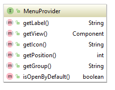

Ilustración 38. Diagrama de métodos de la interfaz MenuProvider.

Esta interfaz se puede implementar como el siguiente ejemplo:

​     

​    `**import** com.gitlab.pedrioko.core.lang.annotation.Menu;    **import** com.gitlab.pedrioko.core.view.api.MenuProvider;    **import** com.gitlab.pedrioko.core.reflection.ReflectionZKUtil;    **import** com.gitlab.pedrioko.core.view.viewers.crud.CrudView;    **import** com.gitlab.pedrioko.domain.Usuario;    **import** org.zkoss.zk.ui.Component;        @Component    **public class** UsuariosMenuProvider **implements** MenuProvider {       @Override   **public** String getLabel() {     **return** ReflectionZKUtil.*getLabel*(**"usuarios"**);   }       @Override   **public** Component getView() {     **return new** CrudView(Usuario.**class**);   }       @Override   **public** String getIcon() {     **return** **"fa fa-users"**;   }       @Override   **public int** getPosition() {     **return** 2;   }       @Override   **public** String getGroup() {     **return** **"administracion"**;   } }`    

Como se puede observar en el ejemplo el método getView está retornando un objeto de clase CrudView de la clase Usuario, sin embargo se puede retornar cualquier otro componente de vista que extienda de la clase Component del framework ZK, dentro de este framework todos los elementos de vista extienden de esa clase por lo que se puede crear la vista que sea necesaria, otra forma en la que se puede establecer una vista en este método es utilizan vistas creadas en archivos ZUL del framework ZK, en este caso se tiene que realizar como el siguiente ejemplo:

​     

​    `@Override    **public** Component getView() {   **return** Executions.*createComponents*(**"~./zul/content/profile.zul"**, **null**, **null**); }`    

## 3.4.    Acciones

Las acciones dentro del framework son los diferentes procesos que se pueden realizar sobre los datos, dentro de ellas se incluyen las operaciones de crear, actualizar, consultar y eliminar datos, esas opciones son las que están habilitadas por defecto en las vistas CRUD generadas, estas acciones son implementaciones de la interfaz Action y además de tener la anotación ToolAction, sin embargo, estas son solo las básicas, adicionalmente tiene las siguientes acciones:

### 3.4.1.  Exportar a CSV

Esta acción saldrá por defecto en las vistas CRUD, la función de esta acción es exportar los datos que estén la vista a un archivo CSV, adicionalmente esta exportación también tendrá en cuenta el filtrado que se le hayan realizado a los datos.

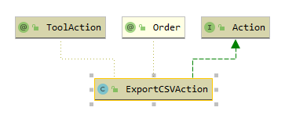

Ilustración 39. Diagrama de la acción ExportCSVAction.

### 3.4.2.  Exportar a PDF

Esta acción saldrá por defecto en las vistas CRUD, la función de esta acción es exportar los datos que estén la vista a un archivo PDF, adicionalmente esta exportación también tendrá en cuenta el filtrado que se le hayan realizado a los datos.

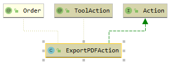

Ilustración 40. Diagrama de la acción ExportPDFAction.

### 3.4.3.  Exportar a Excel

Esta acción saldrá por defecto en las vistas CRUD, la función de esta acción es exportar los datos que estén la vista a un archivo de Excel xls, adicionalmente esta exportación también tendrá en cuenta el filtrado que se le hayan realizado a los datos.

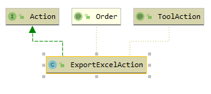

Ilustración 41. Diagrama de la acción ExportExcelAction.

### 3.4.4.  Acción AddAction

Esta acción saldrá en las vistas CRUD de propiedades de clases, con esta acción se puede crear relaciones entre registros existentes en la base de datos, por ejemplo, para la clase ExampleClass la acción AddAction permitiría agregar objetos existentes de la clase Item en la propiedad itemList.

​     

​    `@Entity    **public class** ExampleClass {   @Id   @GeneratedValue(strategy = GenerationType.***AUTO\***)   **private long** **id**;   @OneToMany(cascade = CascadeType.***PERSIST\***, fetch = FetchType.***LAZY\***)   **private** List<Item> **itemList**;     }`    

Ilustración 42. Ejemplo de caso para AddAction.

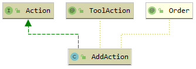

Ilustración 43. Diagrama de la acción AddAction.

### 3.4.5.  Acción SearchAction

Esta acción saldrá en las vistas CRUD, esta acción permite habilitar las opciones de filtrado de la vista CRUD generada, estas opciones son en base a cada una de las propiedades de la clase en cual se creó la vista.

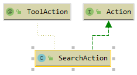

Ilustración 44. Diagrama de la acción SearchAction.

### 3.4.6.  Agregar Nuevas Acciones

Como se mencionó anteriormente las actions o acciones son diferentes operaciones que se puede realizar en los CrudView, estas acciones se crean Implementando la interface Action y anotando la implementación con la anotación ToolAction, por ejemplo:

​     

​    `@Component    **public class** ExampleAction **implements** Action {  ``  @Autowired   **private** CrudService **crudService**;       @Override   **public** String getLabel() {     **return** **"Revisar Item"**; ``  }       @Override   **public** String getIcon() {     **return** **"fas fa-play"**;   }       @Override   **public void** actionPerform(CrudActionEvent event) {    /* El código de la accion ir dentro de este metodo*/   }       @Override   **public** List<?> getAplicateClass() {     **return** Arrays.*asList*(Item.**class**);   }       @Override   **public** Integer position() {     **return 3**;   }       @Override   **public** String getColor() {     **return** **"#45751"**;   }       @Override   **public int** getGroup() {     **return** 0;   } }`             

Como se puede ver en el ejemplo la implementación de la interfaz Action requiere la sobrescritura de varios métodos, sin embargo, hay otros métodos de la interfaz que son opcionales, estos se pueden observar en el siguiente gráfico:

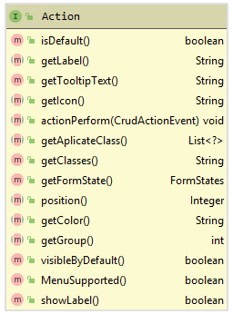

Ilustración 45. Diagrama de métodos de la interfaz Action.

Cada uno de los métodos de esta interfaz tiene una función en específico, cada uno de estos se especifica a continuación: 

·     getLabel(): este será la etiqueta que tendrá la action cuando se renderice en el navegador.

·     getTooltipText(): este sera el texto del tooltip que se mostrar cuando se ponga el mouse por cierto tiempo sobre el boton de la action.

·     getIcon(): este será el icono que tendrá la action, los iconos que se pueden usar aquí son los incluidos por ZK y también los iconos que sean incluidos dentro del tema que se esté utilizando.

·     actionPerform(CrudActionEvent event): este método será llamado cuando le den click al botón que representa la action en la vista, este método recibe un objeto de tipo CrudActionEvent que tiene varios valores que permiten la interacción con el objeto seleccionado con el registro seleccionado en la vista CrudView.

 

La clase CrudActionEvent tiene los siguientes atributos:

 

Ilustración 46. Diagrama de propiedades de la clase CrudActionEvent.

·     type: es la clase del valor del atributo value, también es la clase base del CrudView donde se ejecutó la acción.

·     formstate: es estado en el cual se visualizó la acción.

·     value: es el registro que se seleccionó en la vista antes de darle clic al botón de la acción, si no se selecciona ningún registro este atributo tendrá valor null.

·     crudViewParent: es el crudview donde se ejecutó la acción.

## 3.5.    Personalización

La personalización de las diferentes vistas del framework es un punto importante dentro de él, para ello se utilizan varios archivos Zul que funcionan como plantillas para cada vista y parte de vista que genera o controla el framework, entre esas vistas se encuentran la vistas CRUD, la vista de login, la vista de recuperación de cuenta, la vista de panel principal del software, la vista de mensajes de error, el menú que tendrá el software, entre otras vistas.

Para realizar una personalización de cada una de las vistas se tienen la estructura de carpetas y ubicaciones de los diferentes archivos Zul

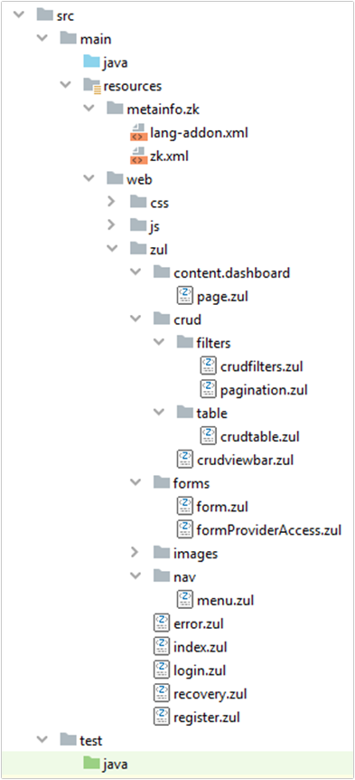 

Ilustración 47. Diagrama de carpetas para los archivos plantillas zul.

Para cada una de las vistas están establecidos los siguientes archivos:

### 3.5.1.  Vista de login

La vista de login es generada en base al archivo login.zul, este archivo debe ser ubicado en la ruta:

​     

​        src/main/resources/web/zul/login.zul        

Ilustración 48. Ruta del archivo zul del login

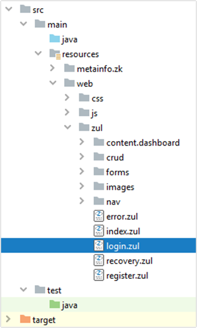 

​             Ilustración 49. Ubicación grafica del archivo zul de la vista login.      

Este archivo zul puede utilizar todas las etiquetas y funciones disponibles en el framework ZK, adicionalmente se puede utilizar lenguajes como HTML, CSS y JavaScript, por lo que se puede realizar una personalización de esta vista para que cumpla con los requerimientos y requisitos del software a desarrollar, adicionalmente esta vista está asociada con el ViewModel de nombre LoginVM, este ViewModel tiene los siguientes métodos y atributos que se puede utilizar para personalizarlo:

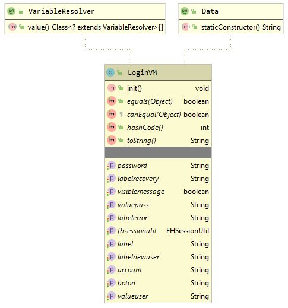 

Ilustración 50. Diagrama de métodos y propiedades del ViewModel LoginVM.

#### 3.5.1.1.            Propiedades

·     password: esta propiedad tiene la etiqueta para el campo de contraseña del usuario.

·     labelrecovery: esta propiedad tiene el valor del texto para el enlace a la página de recuperación de la cuenta.

·     valuepass: esta propiedad es para la contraseña digitada por el usuario.

·     visisblemessage: esta propiedad indica cuando hay un error en la validación de inicio de sesión.

·     valuepass: esta propiedad es para la contraseña digitado por el usuario.

·     fhsessionutil: esta propiedad es del tipo FHSessionUtil que tiene el usuario de sesión actual.

·     label: esta propiedad tiene la etiqueta que se puede utilizar para el título de la pestaña en el navegador.

·     labelnewuser: esta propiedad tiene el valor del texto para el enlace a la página de creación de la cuenta.

·     account: esta propiedad tiene la etiqueta para el campo de nombre de usuario.

·     botón: esta propiedad tiene la etiqueta para el botón de iniciar sesión.

·     valueuser: esta propiedad es para el nombre de usuario digitado por el usuario.

 

### 3.5.2.  Vista de recuperación de cuenta.

La vista de recuperación de cuenta es generada en base al archivo recovery.zul, este archivo debe ser ubicado en la ruta:

​     

​        src/main/resources/web/zul/recovery.zul        

Ilustración 51. Ruta del archivo zul de la vista de recuperación.

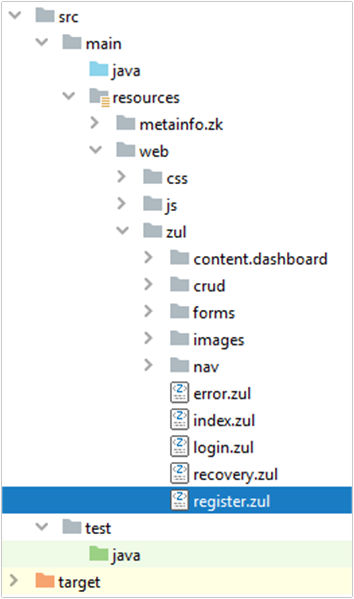 

Ilustración 52. Ubicación grafica del archivo zul de la vista recuperación de cuenta.

Este archivo zul puede utilizar todas las etiquetas y funciones disponibles en el framework ZK, adicionalmente se puede utilizar lenguajes como HTML, CSS y JavaScript, por lo que se puede realizar una personalización de esta vista para que cumpla con los requerimientos y requisitos del software a desarrollar, adicionalmente esta vista está asociada con el ViewModel de nombre RecoveryVM, este ViewModel tiene los siguientes métodos y atributos que se puede utilizar para personalizarlo:

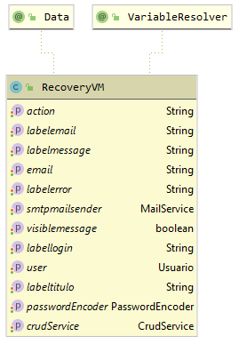 

Ilustración 53. Diagrama de métodos y propiedades del ViewModel RecoveryVM.

#### 3.5.2.1.            Propiedades

·     labeltitulo: esta propiedad tiene la etiqueta para el título del formulario.

·     labelemail: esta propiedad tiene la etiqueta para el campo de email de usuario.

·     labelmessage: esta propiedad tiene la etiqueta para el mensaje de error.

·     email: esta propiedad es para el correo digitada por el usuario.

·     labelerror: esta propiedad tiene la etiqueta para el título de error.

·     crudService: esta propiedad tiene el servicio de acceso a datos que se utiliza para obtener el usuario al cual se va recuperar.

·     smtpmailsender: esta propiedad tiene el servicio de envío de correos que se utilizar para generar una nueva contraseña al usuario.

·     passwordEncoder: esta propiedad tiene el password encoder que utilizar para generar una nueva contraseña al usuario.

·     action: esta propiedad tiene la etiqueta para el botón de ejecución del proceso de recuperación.

·     labellogin: esta propiedad tiene la etiqueta para el título de la vista.

·     visiblemessage: esta propiedad tiene el valor booleano cuando se presenta un error. 

#### 3.5.2.2.            Métodos

·     recover(): es el método que realiza todo el proceso de recuperación de cuenta.

 

### 3.5.3.  Vista de registro

La vista de registro es generada en base al archivo register.zul, este archivo debe ser ubicado en la ruta:

​     

​        src/main/resources/web/zul/register.zul        

Ilustración 54. Ruta del archivo zul de la vista de registro.

 

Ilustración 55. Ubicación grafica del archivo zul de la vista de registro.

Este archivo zul puede utilizar todas las etiquetas y funciones disponibles en el framework ZK, adicionalmente se puede utilizar lenguajes como HTML, CSS y JavaScript, por lo que se puede realizar una personalización de esta vista para que cumpla con los requerimientos y requisitos del software a desarrollar, adicionalmente esta vista está asociada con el ViewModel de nombre RecoveryVM, este ViewModel tiene los siguientes métodos y atributos que se puede utilizar para personalizarlo:

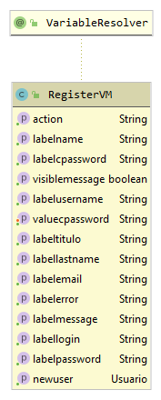 

Ilustración 56. Diagrama de métodos y propiedades del ViewModel RegisterVM.

#### 3.5.3.1.            Propiedades

·     labeltitulo: esta propiedad tiene la etiqueta para el título de la vista.

·     labelemail: esta propiedad tiene la etiqueta para el campo de correo de usuario.

·     labelusername: esta propiedad tiene la etiqueta para el campo de nombre de usuario.

·     labelpassword: esta propiedad tiene la etiqueta para el campo de contraseña del usuario.

·     labelcpassword: esta propiedad tiene la etiqueta para el campo de confirmación de contraseña del usuario.

·     email: esta propiedad es para el valor de correo digitado por el usuario.

·     valuecpassword: esta propiedad es para el valor de contraseña digitado por el usuario.

·     labelname: esta propiedad tiene la etiqueta para el campo de nombre del usuario.

·     labellastname: esta propiedad tiene la etiqueta para el campo de lastname de usuario.

·     labelmessage: esta propiedad tiene la etiqueta para el campo de mensaje.

·     labelerror: esta propiedad tiene la etiqueta para el título de error.

·     crudService: esta propiedad tiene el servicio de acceso a datos que se utiliza para guardar el usuario.

·     smtpmailsender: esta propiedad tiene el servicio de envío de correos.

·     action: esta propiedad tiene la etiqueta para el botón de ejecución del proceso de recuperación.

·     visiblemessage: esta propiedad tiene la etiqueta para el campo de nombre de usuario.

·     labellogin: esta propiedad tiene la etiqueta para el título del formulario de registro.

#### 3.5.3.2.            Métodos

·     register(): es el método que realiza todo el proceso de creación de cuenta.

### 3.5.4.  Vista Principal

La vista principal del software es la que saldrá después que el usuario realice inicio de sesión, esta será generada en base al archivo index.zul, este archivo debe ser ubicado en la ruta:

 

​     

​        src/main/resources/web/zul/index.zul        

Ilustración 57. Ruta del archivo zul de la vista principal.

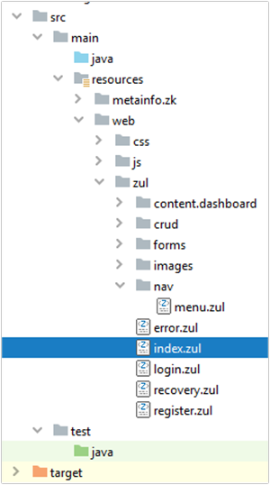 

Ilustración 58. Ubicación grafica del archivo zul de la vista principal.

Este archivo zul puede utilizar todas las etiquetas y funciones disponibles en el framework ZK, adicionalmente se puede utilizar lenguajes como HTML, CSS y JavaScript, por lo que se puede realizar una personalización de esta vista para que cumpla con los requerimientos y requisitos del software a desarrollar.

### 3.5.5.  Plantilla del menú de navegación

El menú de navegación del software es generado en base al archivo index.zul, este archivo debe ser ubicado en la ubicación:

​     

​        src/main/resources/web/zul/nav/menu.zul        

Ilustración 59. Ruta del archivo zul del menú.

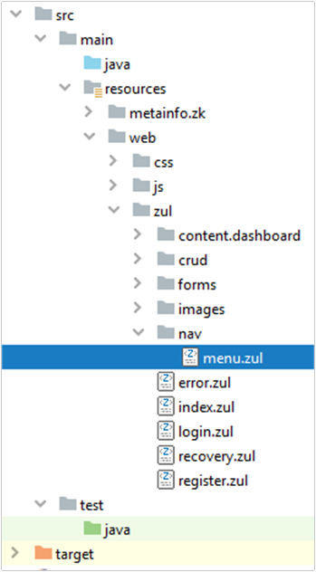 

Ilustración 60. Ubicación grafica del archivo zul del menú de navegación.

 

Este archivo zul puede utilizar todas las etiquetas y funciones disponibles en el framework ZK, adicionalmente se puede utilizar lenguajes como HTML, CSS y JavaScript, por lo que se puede realizar una personalización de esta vista para que cumpla con los requerimientos y requisitos del software a desarrollar, adicionalmente esta vista está asociada con el ViewModel de nombre Menu, este ViewModel tiene los siguientes métodos y atributos que se puede utilizar para personalizarlo:

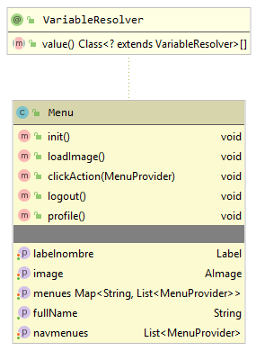 

Ilustración 61. Diagrama de métodos y propiedades del ViewModel Menu.

#### 3.5.5.1.            Propiedades

·     contentView: esta propiedad tiene el servicio que controla las nuevas vistas que se mostrarían al usuario.

·     user: esta propiedad tiene el usuario que inicio sesión.

·     image: esta es la imagen de avatar del usuario que inicio sesión.

·     labelnombre: este es el nombre completo del usuario que inicio sesión.

·     menues: este es el listado de menús agrupados por el grupo al cual pertenecen.

·     navmenues: este es el listado de menús que no están asignados dentro de un grupo.

·     securityService: esta propiedad tiene el servicio de seguridad con el cual se obtienen los menús a los cuales tiene acceso el usuario.

·     fhsessionutil: esta propiedad es del tipo FHSessionUtil que tiene el usuario de sesión actual.

#### 3.5.5.2.            Métodos

·     loadImage(): este método se encarga de cargar la imagen dentro de la propiedad image.

·     clickAction(): este método se encarga de cargar la vista que corresponde al MenuProvider.

·     logout(): este método se encarga de cerrar la sesión del usuario.

·     profile(): este método carga la vista de detalles para la cuenta del usuario.

### 3.5.6.  Vista CRUD

Las vistas CRUD están compuestas de cuatro partes principalmente, estas partes son la barra de acciones, la tabla de registros, el panel de filtrado de datos y finalmente el panel de paginación, cada una de estas partes tiene su propio archivo zul para que pueda ser personalizado de acuerdo a las necesidades, requerimientos o requisitos del software, este archivo debe ser ubicado en esta ruta:

​     

​        src/main/resources/web/zul/crud        

Ilustración 62. Ruta de los archivos zul de las vistas CRUD.

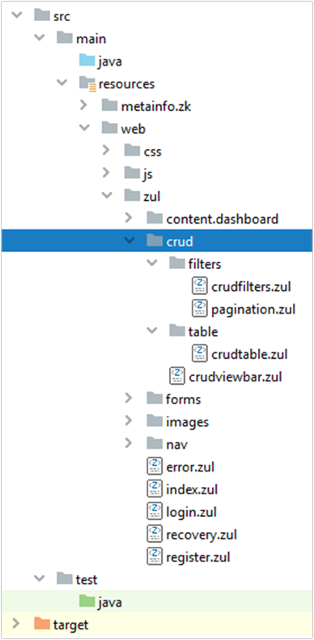 

Ilustración 63. Ubicación grafica de los archivos zul de las vistas CRUD.

A continuación, se describen cada una de las partes personalizables de las vistas CRUD. 

#### 3.5.6.1.            Barra de acciones 

La barra de acciones es donde se mostrar todas las acciones por defecto de la vista CRUD y las acciones específicas para la clase base de la vista CRUD, para estas acciones se puede colocar cualquier tipo de elemento HTML para que en su evento clic accione la función correspondiente, adicionalmente para hacer que tenga una mejor apariencia se puede utilizar CSS o cualquier framework CSS que se agregue al proyecto.

El archivo zul correspondiente a esta parte es el crudviewbar.zul y debe ser ubicado en la ruta:

​     

​        src/main/resources/web/zul/crud/crudviewbar.zul        

Ilustración 64. Ruta del archivo zul de la barra de acciones de las vistas crud.

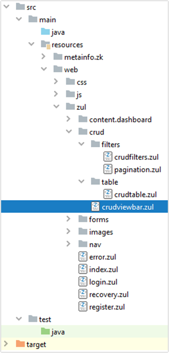 

Ilustración 65. Ubicación grafica del archivo zul de la barra de acciones

Dentro de este archivo zul aparte de poder utilizar todas las funcionalidades del framework ZK y los lenguajes web como HTML, CSS y JavaScript, también se pueden utilizar las propiedades y métodos del ViewModel asociado a este parte de la vista CRUD, estas son:

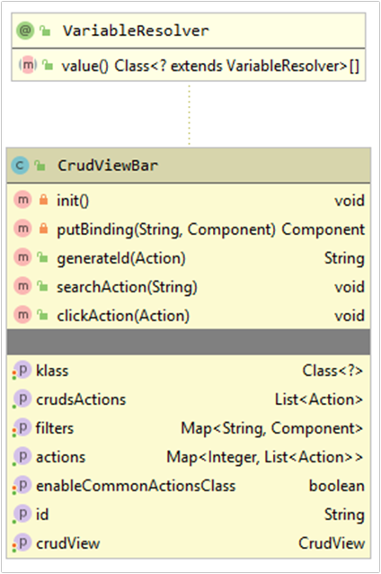 

Ilustración 66. Diagrama de métodos y propiedades del ViewModel CrudViewBar.

##### 3.5.6.1.1.         Propiedades

·     klass: esta es la clase base de la vista crud.

·     crudsActions: este es el listado de acciones comunes de las vistas crud.

·     filters: este es el listado de filtros que saldrían en la barra de acciones, estos filtros serian generales para todos los diferentes datos de los registros.

·     actions: este es listado completo de todas las acciones de la vista crud agrupadas por el grupo al cual pertenecen.

·     enableCommonActionsClass: esta propiedad booleana indica si las acciones comunes del crud están habilitadas para el usuario actual.

·     id: este es el id único para la barra de acciones, se tiene que asignar al componente principal dentro del archivo zul.

·     crudView: este es la vista CRUD a la cual pertenece la barra de acciones actual.

##### 3.5.6.1.2.         Métodos

·     putBinding(): este método sirven para relacionar una propiedad con el componente de filtro.

·     generateId(): este método generar un id único para la acción recibida en el parámetro.

·     searchAction(): este método es para accionar una búsqueda dentro los campos de tipo String de la clase base, esta operación ejecutara una consulta de contiene a todos los registros en la base de datos utilizando el valor recibido en el parámetro.

·     clickAction(): este método se encarga de ejecutar el método actionPerform que corresponde al Action que se le hizo clic.

 

#### 3.5.6.2.            Panel de filtrado 

El panel de filtrado es donde saldrán todas las opciones para filtrar los registros dentro de la vista CRUD, estos filtros son en base a las diferentes propiedades que tenga la clase base de la vista CRUD, para estos filtros se utilizan componentes de ZK específicos para cada uno de los tipos de datos de las propiedades, sin embargo, estos se pueden personalizar mediante el uso de HTML, CSS o cualquier framework CSS que se agregue al proyecto.

El archivo zul correspondiente a esta parte es el crudfilters.zul y debe ser ubicado en la ruta:

​     ​        src/main/resources/web/zul/crud/filters/crudfilters.zul        

Ilustración 67. Ruta del archivo zul del panel de filtrado de las vistas crud.

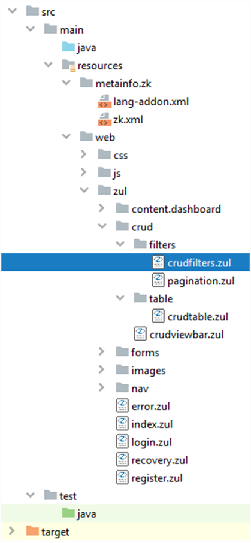 

Ilustración 68. Ubicación grafica del archivo zul del panel de filtrado de las vistas CRUD.

Dentro de este archivo zul aparte de poder utilizar todas las funcionalidades del framework ZK y los lenguajes web como HTML, CSS y JavaScript, también se pueden utilizar las propiedades y métodos del ViewModel asociado a este parte de la vista CRUD, estas son:

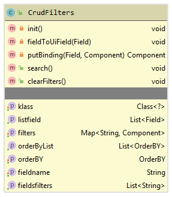 

Ilustración 69. Diagrama de métodos y propiedades del ViewModel CrudFilters.

 

##### 3.5.6.2.1.         Propiedades

·     klass: esta es la clase base de la vista CRUD.

·     listfield: este es el listado de componentes y el campo al cual están asociados.

·     filters: esta propiedad es el listado de Fields que se utilizaran para crear el listado de componentes de filtros.

·     orderByList: esta propiedad es el listado de opciones de ordenado disponibles para vista CRUD.

·     orderBy: esta propiedad es la forma en cómo se van a ordenar, ya sea ascendentemente o descendentemente.

·     fieldname: este es el nombre de la propiedad por la cual se van a ordenarlos los registros de la vista CRUD:

·     fieldsfilters: este es el listado de nombres de las propiedades de la clase base.

##### 3.5.6.2.2.         Métodos

·     fieldToUiField(): este método devuelve el componente ZK que corresponde al tipo de dato del Field recibido en el parámetro.

·     putBinding(): este método sirven para relacionar una propiedad con el componente de filtro.

·     search(): este método ejecuta el filtrado de los registros utilizando los valores no nulos de los campos de filtrado.

·     clearFilters(): este método limpia los valores de todos los campos de filtrado.

 

#### 3.5.6.3.            Tabla de datos 

El panel de paginación es donde saldrán todos los registros de la base de datos de la clase base de la vista CRUD, el nombre de tabla es por la tabla que tiene por defecto las vistas CRUD, si es necesario se puede cambiar por una rejilla o cualquier otra forma de mostrar registros, esta parte de las vistas CRUD se pueden personalizar mediante el uso de HTML, CSS o cualquier framework CSS que se agregue al proyecto.

El archivo zul correspondiente a esta parte es el crudtable.zul y debe ser ubicado en la ruta:

​     

​        src/main/resources/web/zul/crud/table/crudtable.zul        

Ilustración 70. Ruta del archivo zul de la tabla de datos de las vistas CRUD.

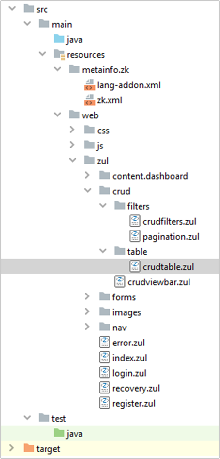 

Ilustración 71. Ubicación grafica del archivo zul de la tabla de datos de las vistas CRUD.

Dentro de este archivo zul aparte de poder utilizar todas las funcionalidades del framework ZK y los lenguajes web como HTML, CSS y JavaScript, también se pueden utilizar las propiedades y métodos del ViewModel asociado a este parte de la vista CRUD, estas son:

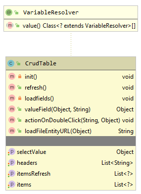 

Ilustración 72. Diagrama de métodos y propiedades del ViewModel CrudTable.

##### 3.5.6.3.1.         Propiedades

·     selectValue: esta propiedad es para el registro que se haya seleccionado.

·     headers: esta propiedad es el listado de cabeceras o datos que pueden ser vistos en la tabla de datos.

·     itemRefresh: este es listado de registros con los valores de cada una de sus propiedades recargados.

·     ítems: esta propiedad es el listado de registros.

##### 3.5.6.3.2.         Métodos

·     refresh(): este método refresca los registros que se están mostrando en la vista CRUD.

·     loadfields(): esta propiedad es el listado de Fields de la clase base que se podrían utilizar para ser mostrados en la tabla de datos.

·     valueField(): este método permite obtener el valor de un propidad del objecto recibido en parámetro.

·     actionOnDoubleClick(): este método permite ejecutar una acción de la barra de acciones del CRUD, la idea de este método es que se utilice para cuando se realice un doble clic en el registro.

·     loadFileEntityURL(): este método retorna al url asociada a un objeto de tipo FileEntity.

#### 3.5.6.4.            Panel de paginación

El panel de paginación es donde saldrán todas las páginas de todos los registros en la base de datos, por defecto las vistas CRUD implementan paginación en las consultas realizadas a la base de datos para optimizar los tiempos de cargas de las diferentes partes, esta parte lo que permitiría al usuario es moverse entre las los registros de la clase base que se encuentras almacenados en la base de datos, esta parte de las vistas CRUD se pueden personalizar mediante el uso de HTML, CSS o cualquier framework CSS que se agregue al proyecto.

El archivo zul correspondiente a esta parte es el pagination.zul y debe ser ubicado en la ruta:

​     

​        src/main/resources/web/zul/crud/filters/pagination.zul        

Ilustración 73. Ruta del archivo zul del panel de paginación de las vistas CRUD.

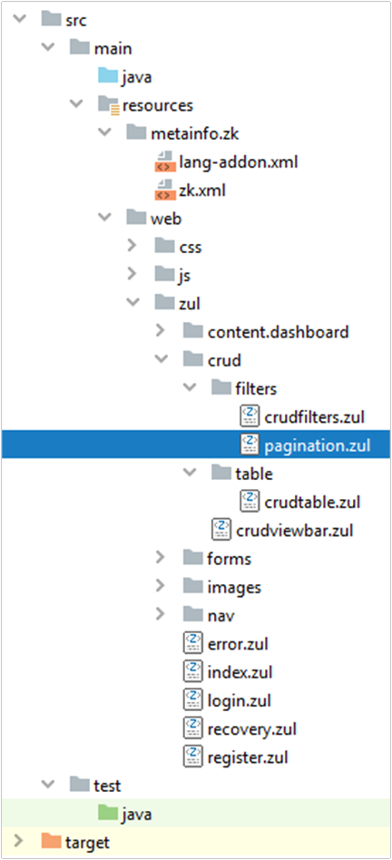 

Ilustración 74. Ubicación grafica del archivo zul del panel de paginación de las vistas CRUD.

Dentro de este archivo zul aparte de poder utilizar todas las funcionalidades del framework ZK y los lenguajes web como HTML, CSS y JavaScript, también se pueden utilizar las propiedades y métodos del ViewModel asociado a este parte de la vista CRUD, estas son:

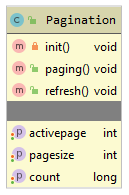 

Ilustración 75. Diagrama de métodos y propiedades del ViewModel Pagination.

##### 3.5.6.4.1.         Propiedades

·     activepage: esta es la página de registros que se encuentra actualmente activa y está siendo mostrada al usuario en la tabla de datos de la vista CRUD.

·     pagesize: esta propiedad es la cantidad de registros que se obtendrán y mostrarán por cada página de registros.

·     count: esta propiedad es la cantidad total de registros en la base de datos.

##### 3.5.6.4.2.         Métodos

·     paging(): este método cargara la página siguiente al momento de realizar el cambio en la página activa.

·     refresh(): este método recargara la página actual.

### 3.5.7.  Vista de Formulario

Las vistas de formularios dentro del framework para las acciones CRUD (crear, leer, actualizar y eliminar) son generadas en base al archivo form.zul, este debe ser ubicado en la ubicación:

​     

​        src/main/resources/web/zul/forms/form.zul        

Ilustración 76. Ruta del archivo zul del menú.

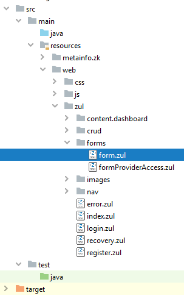 

Ilustración 77. Ubicación grafica del archivo zul de los formularios.

 

Este archivo zul puede utilizar todas las etiquetas y funciones disponibles en el framework ZK, adicionalmente se puede utilizar lenguajes como HTML, CSS y JavaScript, por lo que se puede realizar una personalización de esta vista para que cumpla con los requerimientos y requisitos del software a desarrollar, adicionalmente esta vista está asociada con el ViewModel de nombre EntityForm, este ViewModel tiene los siguientes métodos y atributos que se puede utilizar para personalizarlo:

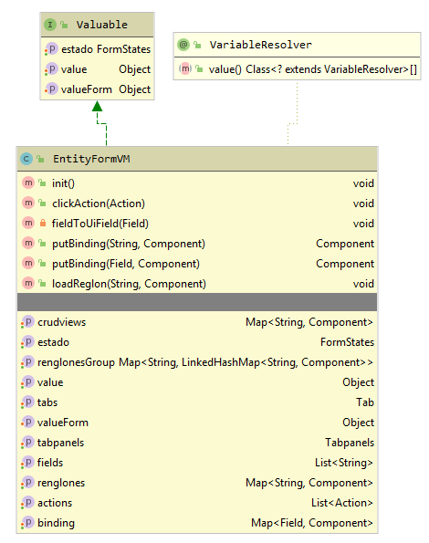 

Ilustración 78. Diagrama de métodos y propiedades del ViewModel EntityForm.

#### 3.5.7.1.            Propiedades

·     value: este es objeto valor que manejara el formulario.

·     event: este será el evento que se enviará cuando se ejecute alguna de las acciones del formulario.

·     fieldsBase: es el listado de propiedades que serán utilizables en el formulario y que pertenecen a la clase base del formulario.

·     binding: esta propiedad es el listado que relaciona cada propiedad con el valor correspondiente que tendría.

·     renglones: esta propiedad es el listado de campos con su nombre y el componente que se mostrara en la vista.

·     crudviews: esta propiedad es el listado de subcrudviews que corresponden a propiedades de la clase base, esta solo está disponible para propiedades de tipo colecciones.

#### 3.5.7.2.            Métodos

·     clickAction(): este método ejecutara la acción recibida en el parámetro.

·     putBinding(): estos métodos sirven para relacionar una propiedad con el valor que tendría.

·     loadRenglon(): este método sirve para relacionar una propiedad con el componente visual asignado para ella.

 # Anexos

## Guia Rapida instalacion FAWSAC en repositorio local MAVEN

https://www.youtube.com/watch?v=im4SDMRc-yE

## Guia Rapida FAWSAC crear proyecto

https://www.youtube.com/watch?v=8jkUOWNTuwk

## Guia Rapida FAWSAC crear vista CRUDVIEW y agregarla al menú

https://www.youtube.com/watch?v=HdOYl-z8g_c

## Guia Rapida FAWSAC agregar acciones y utilizar servicios

https://www.youtube.com/watch?v=BimAStiY_gI